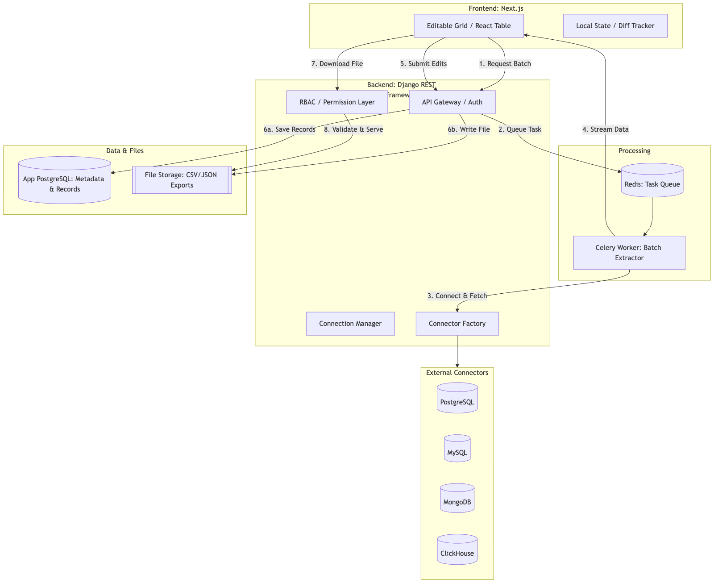

# Data Connector Platform: System Design

This system serves as a bridge between various data sources (SQL, NoSQL, OLAP) and a unified editing interface. It focuses on batch processing, data integrity, and secure file-based exports.

---

## Table of Contents

1. [Requirements](#requirements)
2. [System Architecture](#system-architecture)
3. [Core Components](#core-components)
4. [Database Selection & Schema](#database-selection--schema)
5. [Docker Infrastructure & Deployment](#docker-infrastructure--deployment)
6. [API Endpoint Specifications](#api-endpoint-specifications)
7. [Error Handling & Resilience](#error-handling--resilience)
8. [Unit Testing Strategy](#unit-testing-strategy)
9. [Mock Data Seed Specification](#mock-data-seed-specification)
10. [Project Folder Structure](#project-folder-structure)

---

## Requirements

### Functional Requirements

- **Multi-Source Connectivity:** Securely store and test connection strings for PostgreSQL, MySQL, MongoDB, and ClickHouse.
- **Dynamic Batch Extraction:** Fetch data from any connected source using configurable batch sizes (offset/limit or cursor-based).
- **Unified Editable Grid:** A single frontend interface to modify data from different sources regardless of the original schema.
- **Dual-Persistence Sync:** On submission, data must simultaneously update the internal PostgreSQL database and generate a flat-file (JSON/CSV) export.
- **RBAC File Security:** A "User vs. Admin" permission model for accessing generated data files.
- **Job Tracking:** Status updates for extractions (Pending, Processing, Completed, Failed).

### Non-Functional Requirements

- **Extensibility:** Adding a new database type (e.g., Snowflake) should only require adding one new "Driver" class.
- **Consistency:** Use Atomic Transactions in the backend to ensure that if the DB write fails, the file is not saved (and vice-versa).
- **Responsiveness:** Use Optimistic UI updates on the Next.js grid so the user doesn't feel lag while editing rows.
- **Observability:** Basic health checks for each configured database connection.
- **Portability:** The entire stack must be "one-click" deployable via Docker Compose.

### System Assumptions

- **Schema Flexibility:** Data being edited fits into a tabular format for the grid (even for MongoDB's nested docs).
- **Batch Limits:** Single batch extractions are capped at 100MB or 10,000 rows per request to prevent memory overflow.
- **Storage:** Local disk storage (via Docker volumes) is used for files for the MVP, rather than S3 or Cloud Storage.
- **Authentication:** JWT (JSON Web Tokens) via DRF for session management and RBAC.

---

## System Architecture

The architecture is divided into three main zones: the **Client Layer** (Next.js), the **Application Layer** (Django + Celery), and the **Data/Storage Layer** (the target databases + local files). The system follows a Producer-Consumer pattern for data extraction and a Synchronous Transactional pattern for updates.

### Architecture Principles

- **Extraction:** The backend acts as a bridge — it fetches source data on demand using a Connector Factory and streams it to the frontend. Source data is not stored permanently.
- **State Management:** The frontend (Next.js) holds the "Draft" state of the data. The backend only sees the data again when a user clicks "Submit."
- **Dual-Persistence:** The backend handles a "Two-Phase" write: first to PostgreSQL for record-keeping, then to the file system for export.

### Request Flow

1. **Handshake:** The user provides credentials for a source (e.g., MySQL). The Connection Manager validates the link and stores the config.
2. **Fetch:** The user requests a batch. The Connector Factory identifies the DB type, executes a paginated query, and returns a JSON array.
3. **Edit:** The user modifies rows in the Editable Grid. The frontend tracks "Diffs" (changes) locally.
4. **Sync (Submission):**
   1. Phase A: Data is sent to the DRF API.
   2. Phase B: API writes the updated rows to the application's PostgreSQL.
   3. Phase C: API generates a CSV/JSON file and saves it to a protected volume.
5. **Access:** When a user requests a file, the RBAC Layer checks the `FileMetadata` table to verify the user's role allows the download.



---

## Core Components

### 1. Connection Manager

This component serves as the unified interface for interacting with heterogeneous data sources. It abstracts the complexities of different database protocols into a standardized internal API.

#### Factory Pattern Implementation

A `ConnectorFactory` instantiates the appropriate database driver based on `db_type`, keeping the application layer decoupled from specific database implementations.

- **Base Abstract Class (`BaseConnector`):** Defines the required interface for all connectors — `connect()`, `fetch_batch(query, size, offset)`, and `test_connection()`.
- **Concrete Drivers:**
  - `PostgresConnector` — utilizes `psycopg2` for relational extraction.
  - `MySQLConnector` — utilizes `mysql-connector-python`.
  - `MongoConnector` — utilizes `pymongo` for document-based retrieval and schema flattening.
  - `ClickHouseConnector` — utilizes `clickhouse-driver` for OLAP-speed batching.

#### Connection Configuration Model

| Field         | Type     | Description                                                      |
| ------------- | -------- | ---------------------------------------------------------------- |
| `id`          | UUID     | Primary identifier for the connection.                           |
| `name`        | String   | User-defined label (e.g., "Main Analytics DB").                  |
| `db_type`     | Enum     | Supported types: `postgres`, `mysql`, `mongodb`, `clickhouse`.   |
| `config`      | JSONB    | Securely stored credentials (host, port, user, password, database). |
| `status`      | String   | Result of the most recent health check (Healthy/Offline).        |
| `last_tested` | DateTime | Timestamp of the last connection verification.                   |

#### Health Check & Validation

1. **Validation:** Before any batch extraction, the `ConnectorFactory` runs a lightweight ping (e.g., `SELECT 1` for SQL or `db.command('ping')` for NoSQL).
2. **Error Handling:** Connection failures are caught at the driver level and surfaced to the `status` field, preventing the UI from attempting operations on unreachable sources.

#### Design Decisions

> **Why the Factory Pattern?** It satisfies the Extensibility NFR. Adding a new database (e.g., Snowflake) requires adding a single driver class without modifying existing API logic.

> **Why JSONB for Config?** Different databases require different credential structures (e.g., Mongo connection strings vs. SQL host/port). JSONB provides the necessary schema flexibility.

---

### 2. Batch Extraction Pipeline

This component handles the movement of data from external sources to the platform's internal state. It is designed to manage the high memory overhead of 100MB+ datasets.

#### Extraction Logic

The pipeline uses a Streaming Strategy to prevent the application server from crashing during large transfers.

1. **Cursor-Based Fetching:** Instead of loading 10,000 rows into memory at once, the `ConnectorFactory` initializes a server-side cursor.
2. **Chunking:** Data is processed in sub-batches (e.g., 1,000 rows at a time).
3. **Serialization:** A transformation layer converts DB-specific types (e.g., MongoDB `ObjectId` or MySQL `Decimal`) into standard JSON-compatible formats for the frontend grid.

#### Asynchronous Task Management (Celery + Redis)

1. **Initiation:** The user triggers `POST /extract`. The API returns a `job_id` immediately.
2. **Task Execution:** A Celery worker picks up the job, uses the Connection Manager to talk to the source, and streams the result.
3. **Status Tracking:** The job status (`PENDING`, `PROGRESS`, `SUCCESS`, `FAILED`) is stored in the `ExtractionJob` model.
4. **Completion:** The worker stores the resulting JSON payload in a temporary Redis cache or staging table for the frontend to fetch.

#### ExtractionJob Model

| Field            | Type       | Description                                       |
| ---------------- | ---------- | ------------------------------------------------- |
| `job_id`         | UUID       | Primary identifier.                               |
| `connection_id`  | ForeignKey | Links to the Connection Manager config.           |
| `batch_size`     | Integer    | User-defined limit (max 10,000).                  |
| `query_metadata` | JSONB      | Stores the specific SQL query or Mongo filter used. |
| `status`         | Enum       | Current state of the extraction.                  |
| `result_preview` | JSONB      | A small snippet of data for the initial grid render. |

#### Design Decisions

> **Why Celery?** Standard DRF views timeout at 30–60s. 100MB extractions over slow networks exceed this. Celery allows the process to run in the background.

> **Why Redis for Staging?** It provides sub-millisecond retrieval for the frontend once extraction is complete, acting as a high-speed buffer between the source DB and the UI.

---

### 3. Editable Grid State

This component manages the lifecycle of data once it reaches the frontend, focusing on user interaction and the transition from "Raw Data" to "Modified Payload."

#### State Management Strategy

To ensure performance with large datasets (100MB / 10k rows), the frontend uses a Local Diff Tracking approach rather than sending every keystroke to the backend.

1. **Initial Load:** The grid is populated with the result of the Batch Extraction Pipeline.
2. **Dirty State Tracking:** The system maintains a "Diff Map" of changes:
   ```json
   { "row_id": { "field_name": { "old": "val", "new": "updated_val" } } }
   ```
3. **Optimistic Updates:** The UI reflects changes immediately. Validation (e.g., checking for nulls or type mismatches) is performed locally before the "Submit" button is enabled.

#### Grid Features (Next.js + TanStack Table)

- **Inline Editing:** Cells transform into input fields (text, number, or boolean) based on the inferred data type from the source.
- **Row-Level Updates:** Users can mark rows as "Updated" or "Pending Deletion."
- **Conflict Resolution:** The frontend tracks a version timestamp to enforce "Last Write Wins" or warn about potential overwrites.

#### Data Normalization Layer

- **Flattening:** Nested MongoDB documents are flattened into dot-notation format (e.g., `user.profile.name` → `user_profile_name`) to fit the tabular grid.
- **Type Casting:** Ensures dates and numbers from different DB drivers are formatted consistently for React components.

#### MongoDB Array Handling (Normalization Logic)

```python
def flatten_mongo_doc(doc, prefix=''):
    items = {}
    for key, value in doc.items():
        new_key = f"{prefix}{key}" if prefix else key

        # Handle ObjectIDs and Dates (BSON to JSON)
        if key == '_id':
            items[new_key] = str(value)
        # Handle Nested Arrays/Objects
        elif isinstance(value, dict):
            items.update(flatten_mongo_doc(value, f"{new_key}_").items())
        elif isinstance(value, list):
            # Convert arrays to comma-separated strings or indexed keys
            items[new_key] = ", ".join([str(i) for i in value])
        else:
            items[new_key] = value
    return items
```

#### Design Decisions

> **Why Local Diff Tracking?** Sending individual updates for every cell edit creates unnecessary network overhead and database load. Collecting all changes into a single "Submit" event is more efficient for batch ETL.

> **Why Next.js?** It provides a robust environment for managing complex frontend states while allowing SSR of the initial connection dashboard for faster perceived load times.

---

### 4. Dual Storage Strategy

This component ensures data integrity and persistence by simultaneously updating the application database and generating a physical file export. It is the "Action" phase of the system.

#### Transactional Submission Flow

1. **Validation Layer:** DRF performs a final schema check against the incoming JSON payload (data types, mandatory fields).
2. **Database Persistence:** Updated records are saved to the App PostgreSQL database, enabling historical tracking, auditing, and future re-editing.
3. **File Generation:** A serialization engine converts the JSON payload into the requested format (JSON or CSV). Metadata is appended: `source_db_id`, `extracted_at_timestamp`, and `user_id`.
4. **Storage Execution:** The file is written to a Protected Volume (Docker-mounted) with a unique, non-guessable UUID filename.

#### FileMetadata Model

| Field             | Type       | Description                                                        |
| ----------------- | ---------- | ------------------------------------------------------------------ |
| `file_id`         | UUID       | Primary key and filename on disk.                                  |
| `file_path`       | String     | Absolute path to the file in the storage volume.                   |
| `format`          | Enum       | CSV or JSON.                                                       |
| `owner_id`        | ForeignKey | Links to the User who triggered the submission.                    |
| `source_metadata` | JSONB      | Details about the origin (e.g., "Extracted from MySQL Production"). |
| `checksum`        | String     | SHA-256 hash to ensure the file has not been tampered with.        |

#### Consistency Guarantee

To prevent "Partial Success" (where a DB record is saved but the file fails, or vice-versa):

- **Atomic Transactions:** The DB write is wrapped in `transaction.atomic()`.
- **Cleanup Logic:** If the file system write fails, the database transaction is rolled back. If the DB write fails, the temporary file is deleted before the response is sent.

#### Design Decisions

> **Why DB + File?** The DB enables internal application features (search, filtering, history), while the file meets the ETL requirement for external portability and backup.

> **Why UUID Filenames?** Prevents Insecure Direct Object Reference (IDOR) attacks, ensuring users cannot guess other users' filenames on the server.

---

### 5. File Access Control (RBAC)

This component governs the security of generated files, ensuring data isolation between users while providing administrative oversight.

#### Access Level Definition

- **Admin Role:** Grants unrestricted access to all files, regardless of ownership. Admins can view metadata, download files, and monitor global extraction history.
- **User Role:** Restricts access to a "Self-Service" scope — users can only access files they created (`owner_id == request.user.id`) or files explicitly shared with them.

#### Permission Check Layer (The Gatekeeper)

Files are not served via a public URL. A dedicated Django view performs multi-step verification before streaming data.

1. **Request Initiation:** The user requests a file via `GET /files/{file_id}/download/`.
2. **Metadata Lookup:** The system retrieves the corresponding `FileMetadata` record from the application database.
3. **Authorization Logic:**
   - If `request.user.is_admin` → access granted.
   - If `file.owner_id == request.user.id` → access granted.
   - If the user is found in the `shared_with[]` array → access granted.
   - Otherwise → `403 Forbidden`.
4. **Secure Streaming:** Upon authorization, the file is served using Django's `FileResponse`, streaming in chunks to minimize backend memory usage.

#### FileAccessControl Model

| Field              | Type       | Description                          |
| ------------------ | ---------- | ------------------------------------ |
| `id`               | UUID       | Primary identifier.                  |
| `file_metadata_id` | ForeignKey | Links to the physical file record.   |
| `user_id`          | ForeignKey | The user receiving access.           |
| `access_level`     | Enum       | `VIEWER` or `DOWNLOADER`.            |
| `granted_at`       | DateTime   | Timestamp of the access grant.       |

#### Design Decisions

> **Why a View-Based Check?** Placing files in a public folder makes them vulnerable to URL guessing. A view-based check ensures every download is authenticated and authorized.

> **Why RBAC over ACL?** Role-based access is easier to scale where "Admin" and "User" roles are clearly defined, reducing the complexity of per-file individual permissions.

---

## Database Selection & Schema

### Internal Database: PostgreSQL

PostgreSQL is chosen as the primary application database for its robust support of ACID transactions and JSONB indexing.

- **Relational Integrity:** Essential for managing users, roles, and file ownership (RBAC).
- **Schema Flexibility:** JSONB allows storing varying connection credentials (MySQL vs. MongoDB) and row-level "diffs" without complex migrations.

### Core Schema Models

| Table Name         | Key Fields                                          | Purpose                                 |
| ------------------ | --------------------------------------------------- | --------------------------------------- |
| `Users`            | `id`, `username`, `password_hash`, `role`           | Identity and RBAC.                      |
| `Connections`      | `id`, `name`, `db_type`, `credentials (JSONB)`, `status` | Stores source DB configurations.   |
| `ExtractionJobs`   | `id`, `connection_id`, `status`, `batch_size`, `started_at` | Tracks background ETL tasks.    |
| `ProcessedRecords` | `id`, `job_id`, `data (JSONB)`                      | Stores the actual data rows pulled.     |
| `FileMetadata`     | `id`, `owner_id`, `file_path`, `format`, `checksum` | Tracks physical files on disk.          |
| `FileSharing`      | `id`, `file_id`, `user_id`, `permission_type`       | Manages "Shared with Me" logic.         |

### Indexing Strategy

- **B-Tree Index:** On `owner_id` in `FileMetadata` to speed up the "My Files" dashboard.
- **GIN Index:** On the `credentials` JSONB column in `Connections` for fast lookups of specific connection types.
- **Composite Index:** On `(job_id, status)` to efficiently monitor active background extractions.

#### Design Decisions

> **Why Not NoSQL Internally?** The platform relies heavily on relational logic (linking Users to Connections to Files). A relational DB prevents orphaned records and ensures data consistency during deletions.

> **Why JSONB for Records?** Data from MySQL will have a different schema than data from ClickHouse. JSONB allows the `ProcessedRecords` table to store any structure while remaining searchable.

---

## Docker Infrastructure & Deployment

### Container Orchestration (Docker Compose)

| Service       | Technology                              | Role                                                                    |
| ------------- | --------------------------------------- | ----------------------------------------------------------------------- |
| Web           | Next.js                                 | UI, grid state, and client-side validation.                             |
| API           | Django REST Framework                   | Core business logic, authentication, RBAC, and job triggers.            |
| Worker        | Celery                                  | Headless Django instance dedicated to long-running extractions.          |
| Broker        | Redis                                   | Message transport for Celery and temporary cache for batch data.         |
| App DB        | PostgreSQL                              | Persistent store for metadata, user roles, and file records.             |
| Mock Sources  | Postgres / MySQL / Mongo / ClickHouse   | Pre-configured containers with sample data for immediate testing.        |

### Networking & Volumes

- **Internal Network:** All backend services (API, Worker, DBs) sit on a private network, unreachable from the outside world.
- **`postgres_data`:** Ensures application metadata persists across container restarts.
- **`file_exports`:** A shared volume between the API (to write files) and the Worker (if it handles file generation).

### Deployment Workflow

1. **Build:** `docker-compose build` assembles the custom Next.js and Django images.
2. **Up:** `docker-compose up -d` starts the environment.
3. **Seed:** `python manage.py seed_data` populates the mock source databases with test records.

#### Design Decisions

> **Why a Separate Worker?** Scaling. If the system needs to handle 100 concurrent 100MB extractions, 10 Worker containers can be spun up without scaling the Web or API layers.

> **Why Local Volumes?** For a local development environment, volumes provide the simplest path to "Dual Storage" without requiring external cloud provider credentials.

---

## API Endpoint Specifications

### Connection Management

- `GET /api/connections/` — List all configured source databases.
- `POST /api/connections/test/` — Validates credentials using the Connector Factory before saving.

### Extraction & Grid Data

- `POST /api/extract/`
  - **Body:** `{ connection_id, query, batch_size }`
  - **Action:** Returns a `job_id` and triggers a Celery background task.
- `GET /api/jobs/{job_id}/` — Polls the status and retrieves extracted data once `SUCCESS`.

### Data Submission (The Sync Path)

- `POST /api/submit-batch/`
  - **Body:** `{ job_id, original_data, modified_data, format: "csv"|"json" }`
  - **Action:**
    1. Validates the "Diff Map."
    2. Executes `transaction.atomic()` to update the App DB.
    3. Generates the physical file in the `/storage/` volume.

### File Access & RBAC

- `GET /api/files/` — Lists files available to the current user (Owner or Shared).
- `GET /api/files/{file_id}/download/` — Backend checks `request.user.role`. If authorized, streams the file via `FileResponse`.

#### Design Decisions

> **Why `job_id` for Submissions?** Referencing the original `job_id` lets the backend audit exactly where the data came from and verify that the user hasn't tampered with immutable metadata during editing.

---

## Error Handling & Resilience

### Exception Hierarchy

| Category            | Trigger Example                        | System Response                                    |
| ------------------- | -------------------------------------- | -------------------------------------------------- |
| `ConnectionError`   | Invalid credentials or DB is offline.  | `400 Bad Request`: "Source Unreachable"            |
| `ExtractionError`   | SQL syntax error or Mongo timeout.     | `422 Unprocessable Entity`: "Query Failed"         |
| `TransformationError` | Normalization fails for a specific row. | Log skip: Flag row as "Unreadable" in UI         |
| `PersistenceError`  | Disk full or DB constraint violation.  | `500 Internal Error`: Trigger Transaction Rollback |

### Circuit Breaker Pattern

- **Timeouts:** Every extraction task has a strict 60-second execution limit at the Celery level.
- **Retry Logic:** If a connection fails due to a network blip, the task retries 3 times with exponential backoff before marking the `ExtractionJob` as `FAILED`.

### Frontend Error Boundary

- **Visual Feedback:** If JSON data from the backend is malformed, the grid displays a fallback UI: "Data Format Incompatibility Detected."
- **Validation Toasts:** If the DRF backend returns a `400` (e.g., type mismatch), the specific row ID and error message are highlighted in red on the grid.

### Data Integrity Cleanup

If the file system fails after the database has already been updated:

1. **Signal:** A `post_save` signal or `try/except` block catches the `IOError`.
2. **Rollback:** The system triggers `transaction.set_rollback(True)` to undo database changes.
3. **Audit:** The error is logged to a `SystemLogs` table for Admin review, ensuring no "phantom" database records exist without a corresponding file.

#### Design Decisions

> **Why Exponential Backoff?** Prevents "Thundering Herd" issues where the platform repeatedly hammers a database that is already struggling to stay online.

> **Why Row-Level Highlighting?** In a 10,000-row batch, a single error shouldn't force the user to guess which record caused the failure. Explicit error mapping in the API response is essential for UX.

---

## Unit Testing Strategy

### Backend (Django) Test Suites

- **Connector Logic:** Tests each driver against a mock database to verify `fetch_batch` returns standardized JSON.
- **RBAC Middleware:** Verification that a User role receives `403 Forbidden` when attempting to access a `file_id` owned by another user.
- **Atomic Transactions:** A test case that intentionally fails the file-write step to ensure the database record is correctly rolled back.

### Frontend (Jest / React Testing Library)

- **Grid State:** Verifies that editing a cell correctly updates the "Local Diff Map" without triggering a re-fetch.
- **Validation Rules:** Ensures the "Submit" button remains disabled if a mandatory field (e.g., a non-nullable SQL column) is left empty in the grid.

---

## Mock Data Seed Specification

| Source DB    | Table / Collection | Sample Data Context                        | Unique Type Test          |
| ------------ | ------------------ | ------------------------------------------ | ------------------------- |
| PostgreSQL   | `inventory_items`  | Standard ERP data (SKU, Price, Stock)      | UUIDs & Timestamps        |
| MySQL        | `customer_leads`   | CRM data (Email, Name, Phone)              | Varchar & Booleans        |
| MongoDB      | `user_logs`        | Nested activity logs (User, Actions[])     | Arrays & Nested Objects   |
| ClickHouse   | `sensor_readings`  | High-volume telemetry (Temp, Humidity)     | Int64 & Large Batches     |

A `setup_sources.sh` script runs during the `docker-compose up` phase, executing SQL/NoSQL scripts to ensure the environment is "Ready to Extract" immediately upon launch.

---

## Project Folder Structure

```
data-connector-platform/
├── app/                        # Main Application Source
│   ├── backend/                # Django REST Framework (DRF)
│   │   ├── core/               # Project settings & WSGI
│   │   ├── api/                # Views, Serializers, & RBAC Logic
│   │   ├── connectors/         # Factory Pattern (Postgres, Mongo, etc.)
│   │   │   ├── base.py         # Abstract BaseConnector class
│   │   │   └── drivers/        # DB-specific implementations
│   │   ├── services/           # Business Logic (SRP: Processing & Validations)
│   │   ├── tasks/              # Celery tasks for batch extraction
│   │   └── tests/              # Unit & Integration tests
│   └── frontend/               # Next.js Application
│       ├── components/         # Grid (TanStack) & UI (Shadcn)
│       ├── hooks/              # Diff-tracking & State logic
│       └── services/           # API Client (Axios/Fetch)
├── scripts/                    # Mock DB Seeding (SQL/NoSQL)
├── storage/                    # Shared volume for JSON/CSV exports
├── docker-compose.yml          # Full stack orchestration
├── Makefile                    # Shortcuts for build, test, and seed commands
├── pytest.ini                  # Test runner configuration
├── .gitignore                  # Version control exclusions
└── README.md                   # Setup instructions and Design docs
```

#### Design Decisions

> **`app/` Directory:** Isolating frontend and backend code simplifies Docker build contexts and provides a clear boundary between "Application" and "Infrastructure."

> **`services/` Folder (Backend):** Adhering to the Single Responsibility Principle (SRP), complex logic (e.g., the Dual Storage write sequence) is moved out of Views into dedicated Service classes, making the code highly testable.

> **Root `Makefile`:** Provides a unified interface for the developer to interact with the containerized environment (e.g., `make test`, `make build`, `make seed`).

> **`pytest.ini` at Root:** Enables running the entire test suite from a single command while managing environment variables for the mock databases.